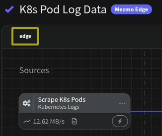

# Mezmo Edge

> Helm chart for managing a Mezmo Edge deployment

## Prerequisites

- Kubernetes 1.10+ (1.23+ if using autoscaling)
- Mezmo Account with Edge Pipeline support
- Mezmo API Token


## Quickstart

```sh
helm install edge mezmo/edge \
  --set mezmoApiAccessToken=<MEZMO_API_ACCESS_TOKEN>
```

In the case above, using `edge` as the name will be reported in our UI for all edge pipelines it gets assigned.  If you have multiple instances to deploy, consider using deployment groups and unique names per `helm install`.



## Kubernetes Logs Source
If you plan to use the Kubernetes Logs Source in your Edge deployment to read pod logs, please be sure to enable it in your Helm values so it has the right permissions set:

> Note: It's also recommended to use a DaemonSet deployment to gain access to all worker nodes and their pod logs.

```sh
helm install edge mezmo/edge \
  --set mezmoApiAccessToken=<MEZMO_API_ACCESS_TOKEN> \
  --set enableK8sLogs=true \
  --set useDaemonSet=true
```

## Service Ports

Service ports are for a Kubernetes service mapping that allows you to use different sources in your edge pipeline that setup TCP/UDP sockets for receiving data.  Ex: Syslog, HTTP, DataDog Agent, etc

By default ports in the range [8000, 8010] are configured for the Kubernetes Service. See `service.sourcePorts.*` values for configuring different ranges.

### Custom service port setup

If you plan on ONLY needing the Kubernetes Log Source to read pod log files, you can turn off the service ports completely

```sh
helm install edge mezmo/edge \
  --set mezmoApiAccessToken=<MEZMO_API_ACCESS_TOKEN> \
  --set service.sourcePorts.end=0 \
  --set enableK8sLogs=true \
  --set useDaemonSet=true
```

Expounding on that capability, you can turn off the port range configure two individual ports (syslog and http) to be exposed:

```sh
helm install edge mezmo/edge \
  --set mezmoApiAccessToken=<MEZMO_API_ACCESS_TOKEN> \
  --set service.sourcePorts.end=0 \
  --set service.sourcePorts.list="{514,80}"
```

Finally, you can also override the default range for a custom one:

```shell
helm install edge mezmo/edge \
  --set mezmoApiAccessToken=<MEZMO_API_ACCESS_TOKEN> \
  --set service.sourcePorts.start=20000 \
  --set service.sourcePorts.end=20020
```

## Configuration

### Values

| **Key**                      | **Type** | **Default**      | **Description**
| ---------------------------- | -------- | ---------------- | ----------------------------------------------------------------------
| mezmoApiAccessToken       | string   |                 | Your Mezmo API access token. This has a lower precedence than `mezmoApiAccessSecret`
| mezmoApiAccessSecret      | string   |                 | Existing secret containing your Mezmo API access token. Given secret should have the token in a key named `api-access-token` and be in the same namespace as the Edge instance. This takes precedence over `mezmoApiAccessToken`
| mezmoDeploymentGroup         | string   |                  | Deployment group to apply to this Edge instance. Leaving undefined pulls all Edge pipelines for the org
| mezmoApiScheme               | string   | "https"          | The scheme to use for the Mezmo API URL
| mezmoApiHost                 | string   | "api.mezmo.com"  | The hostname(:port) of the Mezmo API
| useDaemonSet                 | boolean  | false            | Whether to use DaemonSet deployment model, or StatefulSet deployment model (STS is default)
| remoteTaskInitialPollDelay   | int.     | 5                | How long to wait post start-up to poll for remote tasks (seconds)
| remoteTaskPollStepDelay.     | int.     | 2                | How long to wait between task polling cycles (seconds)
| remoteTaskExecutionTimeout.  | int.     | 60               | How long to wait for remote task calls to complete (seconds)
| namespace                    | string   |                  | Optional namespace for compartmentalization
| logLevel                     | string   | info             | Controls the logging verbosity of the deployment
| autoscaling.enabled          | boolean  | false            | Whether or not to enable a HorizontalPodAutoscaler for this deployment
| service.sourcePorts.start    | int      | 8000             | The start of the port range (inclusive [start, end])
| service.sourcePorts.end      | int      | 8010             | The end of the port range (set 0 or "" to disable port range)
| service.sourcePorts.list     | array[]  | []               | Optional list of discrete ports to configure on the service
| enableK8sLogs                | boolean  | false            | Whether or not to add ClusterRole and Volume access required for k8s logs source
| pvcName                      | string   | ""               | (Statefulset Deployments Only) Optional name for an existing PersistentVolumeClaim to use for disk buffering, aggregate persistence and k8s log checkpoints. Leaving undefined will default to ephemeral storage lasting the lifetime of the pod
| daemonsetVolumeHostPath      | string   | /data/edge       | (Daemonset Deployments Only) Kubernetes worker node host path to use for disk buffering, aggregate persistence and k8s logs checkpoints.
| maxDiskBufferBytes           | int      |268435488 (256MiB)| Optional max number of bytes to store in a disk-backed buffer.
| maxMemBufferEvents           | int      | 1000             | Optional max number of events to store in a memory buffer.
| reduceByteThresholdPerState  | int      | 104857600 (100MiB)| Optional max number of bytes to store in a memory for any given reduce component.
| reduceByteThresholdAllStates | int      | 1073741824 (1GiB) | Optional max number of bytes to store in a memory for all given reduce components.

\* Port 8686 is reserved for internal use, and should not be additionally configured for sourcePorts
